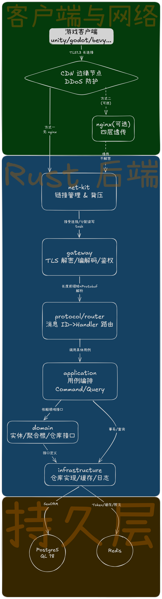
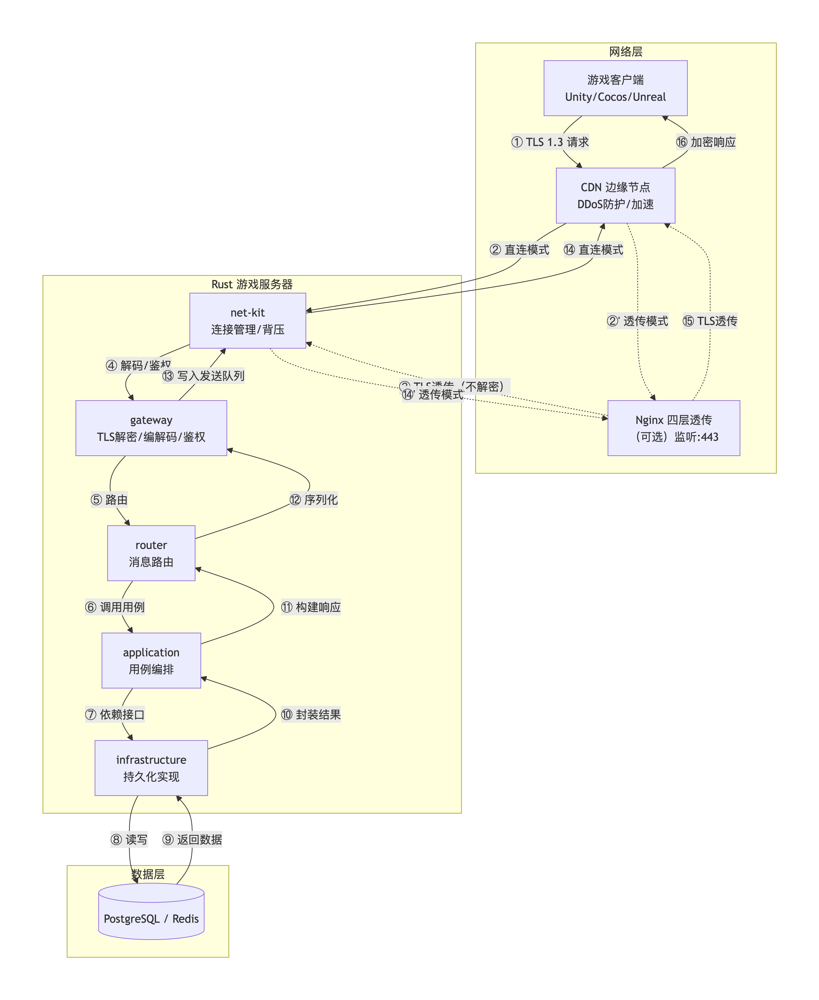

# LongshipX

> **Longship(长船)· Long-connection(长连接)· Long-lasting(长长久久)**

**命名寓意**:Longship 是维京人的长船——木质龙骨历经风浪仍稳固耐航,寓意这套长连接游戏服务器**长长久久、稳定可靠**;"长船"与游戏服务器的立身之本"**长连接**"同名同源;"**X**"则是可自由组合的因子——接入 PostgreSQL、SeaORM、Redis,或将来切换 MySQL、更换传输协议,都只动出站适配器,业务核心分毫不变(得益于洋葱架构的端口 trait,见下文"从哪些文件逐步开发")。

基于 **tokio + TCP/TLS 1.3** 的 Rust 长连接游戏服务器后端,采用 **DDD + 洋葱架构** 组织为 Cargo workspace 多 crate 单体(PRD:`prd.md`)。

## 项目简介

面向中频实时玩法(回合制 / MMORPG / 卡牌 / 社交对战)的长连接服务端:

* **传输**:TCP + rustls(TLS 1.3 only,ring 提供器),长度前缀帧 `[4B len u32 BE][2B opcode][protobuf payload]`;
* **架构**:依赖方向永远指向 domain,crate 边界由编译器强制(见下文分层);
* **并发模型**:每个 Room 一个 Actor task,串行处理命令、无锁;连接读写分离,发送队列有界(慢客户端直接断开);
* **安全**:argon2id 密码哈希、opaque token(可立即吊销)、未鉴权连接限时限量、每连接令牌桶限流、日志脱敏;
* **存储**:PostgreSQL 18(SeaORM 2.0,`uuidv7()` 主键)+ Redis(token 存储,MultiplexedConnection);
* **可观测**:`tracing` 结构化日志(json/pretty)、Prometheus `/metrics`、`/healthz`;
* **优雅停机**:SIGTERM → 停 accept → 广播房间关闭与维护通知 → 排空连接 → 关闭连接池。

## 整体架构图

**分层全景**:客户端与网络(TLS 1.3 长连接,可选 nginx 四层透传)→ Rust 后端五层(net-kit → gateway → protocol/router → application → domain,infrastructure 反向实现 domain 接口)→ 持久层(PostgreSQL 18 / Redis):



**一次 TCP 命令的 16 步旅程**(①TLS 请求 → ④解码/鉴权 → ⑤路由 → ⑥调用用例 → ⑦依赖接口 → ⑧⑨读写数据库 → ⑩⑪构建响应 → ⑫序列化 → ⑬写入发送队列 → ⑯加密响应;理解这条链路,就知道每一步该编辑哪个 crate):



## Workspace 分层

```
crates/
├── domain/            领域层:聚合根(账号/玩家/会话/房间)、值对象、领域事件、仓储 trait(零技术栈依赖)
├── application/       应用层:注册/登录/档案/成长用例、端口 trait、UnitOfWork、Room Actor 与 RoomService
├── net-kit/           通用网络框架:Transport trait、TLS 监听、帧编解码、读写分离、有界背压(零业务依赖)
├── protocol/          协议层:proto/game.proto → prost 生成、GameCodec/ClientCodec、opcode 路由表
├── infrastructure/    基础设施:环境变量配置、SeaORM 仓储、Redis/内存 token 存储、argon2id、事件分发
├── gateway/           接口层:TCP+TLS 入口(绑定/心跳/房间/档案/聊天 + 限流/鉴权门)、axum HTTP 入口
└── server-bin/        组装根:唯一可执行文件(DI、启动、信号处理、优雅停机)+ 可运行示例
migration/             SeaORM 迁移:accounts / players / audit_logs
```

依赖方向:`server-bin → gateway/infrastructure → application → domain`;`protocol → net-kit`。domain 与 net-kit 是两个互不相知的零依赖核心。

## 快速开始

环境要求:Rust 1.98.1(stable)、PostgreSQL 18、Redis、mkcert(本地证书)。

```bash
# 1. 配置(示例已指向 ~/certs 下的 mkcert 开发证书,见 .public_env)
cp .public_env .env                 # 按需修改 DATABASE_URL / REDIS_URL 等

# 2. 本地开发证书(mkcert 已含 localhost/127.0.0.1 SAN,rootCA 已装入系统信任)
mkcert -install
mkcert -cert-file ~/certs/localhost.pem -key-file ~/certs/localhost-key.pem localhost 127.0.0.1

# 3. 构建 & 启动(启动时自动执行 migration)
cargo run -p longshipx-server-bin
```

> 配置路径支持 `~/` 前缀展开(如 `TLS_CERT_PATH=~/certs/localhost.pem`)。

框架自带两个"已完成实现"作参照:HTTP 注册/登录(见 `crates/gateway/src/http/routes.rs`)与 TCP 获取档案命令(见 `crates/gateway/src/tcp/handlers.rs` 的 `handle_get_profile`);可运行客户端示例:`cargo run -p longshipx-server-bin --example quickstart_client -- --token <token> --root-ca "$(mkcert -CAROOT)/rootCA.pem"`。

---

## 开发指南:亲手实现"注册角色(HTTP)"与"获取角色信息(TCP 命令)"

以下按"**拿到一个空白 LongshipX 框架,我要自己把这两个接口做出来**"的视角,给出**逐文件编辑步骤**。每一步都回答三个问题:编辑哪个文件、写什么、为什么放这一层。

### 任务 A:开发"注册角色"HTTP 接口

> HTTP 侧低频 CRUD 走 axum。整个任务只涉及 6 个文件,顺序由依赖方向决定:**先定规则(domain),再定抽象与编排(application),最后接入口(gateway)与组装(server-bin)**。

**第 1 步 — 定义业务规则:`crates/domain/src/account/aggregate.rs`**

领域层是起点,零框架依赖。确认账号聚合有"注册"所需的一切规则(若要新增字段/校验,改这里):

```rust
// 注册工厂:uuid v7 主键、初始状态 Active;密码只收哈希,明文进不了领域层
pub fn register(username: Username, password_hash: PasswordHash, now: DateTime<Utc>) -> Self
```

配套的值对象校验在 `crates/domain/src/shared/value.rs`(`Username::try_new` 长度/字符集、`PlainPassword::try_new` 8~128 字节),注册的所有输入规则都应写在这里并配单测。

**第 2 步 — 声明仓储接口:`crates/domain/src/account/repository.rs`**

用例需要"按用户名查重"和"保存",在领域层声明接口,不关心是谁实现:

```rust
#[async_trait::async_trait]
pub trait AccountRepository: Send + Sync {
    async fn find_by_username(&self, username: &str) -> Result<Option<Account>, RepoError>;
    async fn save(&self, account: &Account) -> Result<(), RepoError>;
}
```

**第 3 步 — 声明技术端口:`crates/application/src/ports.rs`**

密码哈希是"外部能力",应用层只定义端口,argon2 实现由基础设施注入(将来换 bcrypt/云端 KDF,业务零改动——这就是名字里的"X"):

```rust
pub trait PasswordHasher: Send + Sync {
    fn hash(&self, password: &str) -> Result<String, AppError>;
    fn verify(&self, password: &str, hash: &str) -> Result<bool, AppError>;
}
```

**第 4 步 — 定义入参出参:`crates/application/src/dto.rs`**

```rust
pub struct RegisterCommand { pub username: String, pub password: String, pub nickname: String }
pub struct RegisterResult { pub account_id: AccountId, pub player_id: PlayerId, pub nickname: String }
```

**第 5 步 — 编排用例:`crates/application/src/auth/register.rs`**

Command/Query 风格的用例结构体,依赖全部是 trait 对象(`Arc<dyn Trait>`),顺序:校验 → 查重 → 哈希 → 建聚合 → 落库 → 审计:

```rust
pub struct RegisterUseCase { accounts: Arc<dyn AccountRepository>, players: Arc<dyn PlayerRepository>,
                             hasher: Arc<dyn PasswordHasher>, audit: Arc<dyn AuditLogger> }

impl RegisterUseCase {
    pub async fn execute(&self, cmd: RegisterCommand) -> Result<RegisterResult, AppError> {
        let username = Username::try_new(&cmd.username)?;           // 1. 领域校验
        if self.accounts.find_by_username(username.as_str()).await?.is_some() {
            return Err(AppError::Conflict("用户名已被占用".into()));  // 2. 查重
        }
        let hash = PasswordHash::new(self.hasher.hash(&cmd.password)?); // 3. 哈希
        let account = Account::register(username, hash, Utc::now());    // 4. 聚合
        let player = Player::create(account.id(), nickname, Utc::now());
        self.accounts.save(&account).await?;                            // 5. 落库
        self.players.save(&player).await?;
        Ok(RegisterResult { /* ... */ })                                // 6. 回执
    }
}
```

**第 6 步 — 暴露 HTTP 路由:`crates/gateway/src/http/routes.rs`**

axum 处理器只做"JSON ⇄ Command/Result"翻译;错误到状态码的映射在 `crates/gateway/src/http/error.rs`(`ApiError::from(AppError)`),鉴权提取器在 `auth_extractor.rs`:

```rust
async fn register(State(state): State<Arc<HttpState>>, Json(req): Json<RegisterRequest>)
    -> Result<(StatusCode, Json<RegisterResponse>), ApiError>
{
    let result = state.register.execute(RegisterCommand { /* req 映射 */ }).await?;
    Ok((StatusCode::CREATED, Json(RegisterResponse::from(result))))
}
// router() 里挂载:.route("/register", post(register))
```

**第 7 步 — 组装注入:`crates/server-bin/src/bootstrap.rs`**

洋葱架构在组装根闭合:把 infrastructure 的实现塞进用例。`build_services` 中:

```rust
let hasher = Arc::new(Argon2PasswordHasher::new(memory_kb, iterations, parallelism)?);
let register = Arc::new(RegisterUseCase::new(accounts, players, hasher.clone(), audit));
// HttpState { register, .. } → http::routes::router(state)
```

**第 8 步 — 验证**:`cargo run -p longshipx-server-bin` 后 `curl -XPOST localhost:8081/register -d '{...}'`;并补路由层测试(参考 `crates/gateway/tests/http.rs` 的 tower oneshot 写法)。

### 任务 B:开发"获取角色信息"TCP 命令

> TCP 侧走 protobuf 命令。核心是**协议五件套**(protocol crate)→ **用例**(application)→ **处理器与路由**(gateway)→ **端到端验证**。参考实现已内置:`git grep handle_get_profile`。

**第 1 步 — 定义消息:`crates/protocol/proto/game.proto`**

字段号一经发布禁止改作他用(PRD 8.2 🔴),新消息用新字段号并保持 optional:

```protobuf
message GetProfileRequest {}                     // 空入参
message ProfileResponse {
  bool ok = 1;
  optional string player_id = 2;
  optional string nickname = 3;
  optional uint32 level = 4;
  optional uint64 exp = 5;
  optional int64 last_login_at_ms = 6;
  optional string error = 7;
}
```

**第 2 步 — 分配 opcode:`crates/protocol/src/opcodes.rs`**

C2S 用 `0x0nxx` 段、S2C 用 `0x8nxx` 段:

```rust
pub const OP_C2S_GET_PROFILE: u16 = 0x0013;
pub const OP_S2C_PROFILE: u16 = 0x8003;
```

**第 3 步 — 接入编解码:`crates/protocol/src/messages.rs`**

四处 match 各加一个分支:`InboundMessage::GetProfile(...)` / `OutboundMessage::Profile(...)`,以及 `decode_inbound`、`encode_outbound`、`decode_outbound`。

**第 4 步 — 客户端侧编解码:`crates/protocol/src/lib.rs`**

`ClientCodec`(压测工具/测试客户端用)的 `encode` 加对应分支,把 `GetProfile` 编成 `OP_C2S_GET_PROFILE` 帧。

**第 5 步 — (如需新用例)`crates/application/src/player/profile.rs`**

本例是只读查询,直接复用已有 `GetPlayerProfile` 用例;新写法同样是一个结构体 + `execute`:

```rust
pub struct GetPlayerProfile { players: Arc<dyn PlayerRepository> }
impl GetPlayerProfile {
    pub async fn execute(&self, player_id: PlayerId) -> Result<PlayerProfile, AppError> { /* ... */ }
}
```

**第 6 步 — 写处理器:`crates/gateway/src/tcp/handlers.rs`**

鉴权门由连接主循环统一把关(未绑定只放行 Bind),处理器里只管业务;**要给处理器新能力时,加到 `crates/gateway/src/tcp/context.rs` 的 `GatewayDeps`**(本例即注入 `profile` 用例),并在 `server-bin/src/bootstrap.rs` 装配处补一行:

```rust
pub async fn handle_get_profile(ctx: ConnContext, message: InboundMessage)
    -> Result<Option<OutboundMessage>, ProtocolError>
{
    let InboundMessage::GetProfile(_) = message else { /* 路由异构防御 */ };
    let Some(player) = ctx.authed_player() else {
        return Ok(Some(error_notification(ERR_NOT_AUTHENTICATED, "请先完成绑定")));
    };
    match ctx.deps.profile.execute(player.player_id).await {
        Ok(profile) => Ok(Some(OutboundMessage::Profile(pb::ProfileResponse { ok: true, /* ... */ }))),
        Err(err) => Ok(Some(app_error_notification(err))),
    }
}
```

**第 7 步 — 注册路由:`crates/gateway/src/tcp/router_setup.rs`**

```rust
router.route(OP_C2S_GET_PROFILE, handlers::handle_get_profile);
```

**第 8 步 — 端到端验证:`crates/gateway/tests/e2e.rs`**

用 `ClientCodec` 走真实 TLS 加一段"绑定 → 发 GetProfile → 收 Profile"(参考该文件 `bind_heartbeat_and_room_flow_end_to_end`),然后:

```bash
cargo fmt --all && cargo clippy --all-targets -- -D warnings && cargo test --workspace
```

> 顺序为什么是这样?对照上面的 16 步旅程图:消息先过 **protocol**(第 1~4 步决定"线上长什么样"),再进 **application**(第 5 步决定"业务怎么算"),最后由 **gateway**(第 6~7 步)把两者接起来——依赖方向永远指向内层,这正是改不动 domain 的原因,也是换 MySQL/换传输只动外层的保证。

---

## 从哪些文件逐步开发(阅读路线图)

| 顺序 | 文件/目录 | 你会看到什么 |
| --- | --- | --- |
| 1 | `crates/domain/src/shared/value.rs` | 值对象与模型校验(用户名/昵称/密码,日志脱敏) |
| 2 | `crates/domain/src/account/aggregate.rs`、`player/`、`session/`、`room/` | 聚合根与状态机(纯业务规则,0 框架依赖) |
| 3 | `crates/domain/src/*/repository.rs` | 仓储**接口**(实现在 infrastructure,依赖倒置) |
| 4 | `crates/application/src/ports.rs` | 对外部技术的端口 trait(token 存储/密码哈希/审计/事件) |
| 5 | `crates/application/src/auth/`、`player/` | 用例编排:注册/登录/档案/成长 |
| 6 | `crates/application/src/room/actor.rs`、`service.rs` | Room Actor(串行无锁)与跨房间门面 |
| 7 | `crates/net-kit/src/codec.rs`、`connection.rs`、`transport.rs` | 帧协议、读写分离、有界背压、Transport 抽象 |
| 8 | `crates/protocol/proto/game.proto` + `src/messages.rs`、`router.rs` | 消息定义与 opcode 路由表 |
| 9 | `crates/infrastructure/src/config.rs`、`persistence/`、`cache/` | 配置注入、SeaORM 仓储、Redis/内存实现 |
| 10 | `crates/gateway/src/tcp/`、`http/` | 入站适配:连接生命周期、鉴权门、限流、HTTP 路由 |
| 11 | `crates/server-bin/src/bootstrap.rs` | 组装根:谁实例化谁、怎么注入、如何优雅停机 |

## 如何做常见调整(对应文件速查)

| 想做什么 | 改哪些文件 |
| --- | --- |
| 调端口/帧上限/心跳/背压队列等参数 | `.env`(模板见 `.public_env`)→ 默认值与校验在 `crates/infrastructure/src/config.rs` |
| 新增 TCP 消息 | 上文"任务 B"的 8 步清单 |
| 新增 HTTP 接口 | 上文"任务 A"的 6~7 步(路由 + 组装),用例复用 `application` |
| 新增业务用例(登录类) | `crates/application/src/<域>/` 用例 + `dto.rs` + `ports.rs`(如需新端口)→ `gateway` 调用 |
| 新增表/字段 | `migration/src/` 新迁移 → `infrastructure/persistence/entities/` → `converters.rs` → `repositories/` |
| 新增领域规则 | 对应聚合 `crates/domain/src/<聚合>/aggregate.rs` + 内嵌单测 |
| 新增领域事件 | `crates/domain/src/events.rs` 定义 → 发布方在 application → 分发实现在 `infrastructure/src/events.rs` |
| 更换/新增传输(KCP/QUIC) | 实现 `crates/net-kit/src/transport.rs` 的 `Transport` trait,上层不动(PRD 3.4/8.1) |
| 切换数据库(如 MySQL) | `infrastructure` 仓储实现 + `sea-orm` feature(`sqlx-mysql`)+ `.env` 连接串;domain/application 零改动 |
| 调整限流/慢客户端策略 | `crates/gateway/src/tcp/rate_limit.rs`、`handler.rs` |
| 调整优雅停机行为 | `crates/server-bin/src/bootstrap.rs`(`graceful_teardown`)+ `gateway/src/tcp/server.rs` |
| 换 token/密码实现 | `infrastructure/src/cache/`、`password.rs`(实现 application 端口,业务层零改动) |
| 加指标项 | 各处 `metrics::counter!/gauge!` 调用 + `server-bin/src/observability.rs` |

## 开发与测试

```bash
cargo fmt --all -- --check                  # 格式
cargo clippy --all-targets -- -D warnings   # lint
cargo test --workspace                      # 单元测试 + TCP/TLS 端到端(无需数据库)
cargo llvm-cov --workspace --summary-only   # 覆盖率
```

* 单元测试全部可离线运行;SeaORM/Redis 具体实现需要真实服务,不在单测中覆盖;
* 端到端测试使用 rcgen 自签证书走真实 TLS 握手(见 `crates/gateway/tests/e2e.rs`);
* 当前覆盖率基线:全仓行覆盖 ≈ 88%,核心 crate(domain/application/protocol/net-kit/gateway-http)≈ 83%–100%。

## 贡献指南

* **必须**遵守 [AGENTS.md](AGENTS.md)(提交格式 `<type>: <中文描述>`、版本锁定 `=`、CI 检查、DDD 分层红线,追加规范写入其第 10 章);
* CI(GitHub Actions)执行 `fmt --check` / `clippy -D warnings` / `build` / `test`,见 `.github/workflows/rust-ci.yml`;
* 提交前请本地跑通上述"开发与测试"命令。

## License

MIT OR Apache-2.0(见 `LICENSE-MIT` / `LICENSE-APACHE`)。
